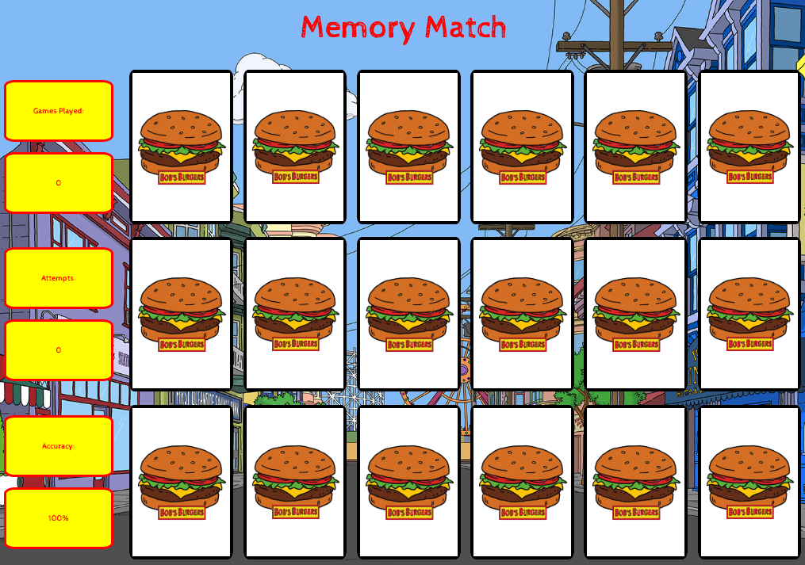

# Bob's Burgers Memory Match

A Bob's Burgers themed memory match game that shares statistics and dynamically shuffles cards after every round.


## Technologies Used

- HTML5
- CSS3
- jQuery
- AWS EC2

## Live Demo

Try the application live at [https://memorymatch.kamrynmin.com](https://memorymatch.kamrynmin.com)

## Features

- User can win by matching all the card pairs.
- User can reset the game and cards will shuffle.

## Preview



## Development


#### Getting Started

1. Start the project.

    ```shell
    Open the index.html file in browser
    ```
